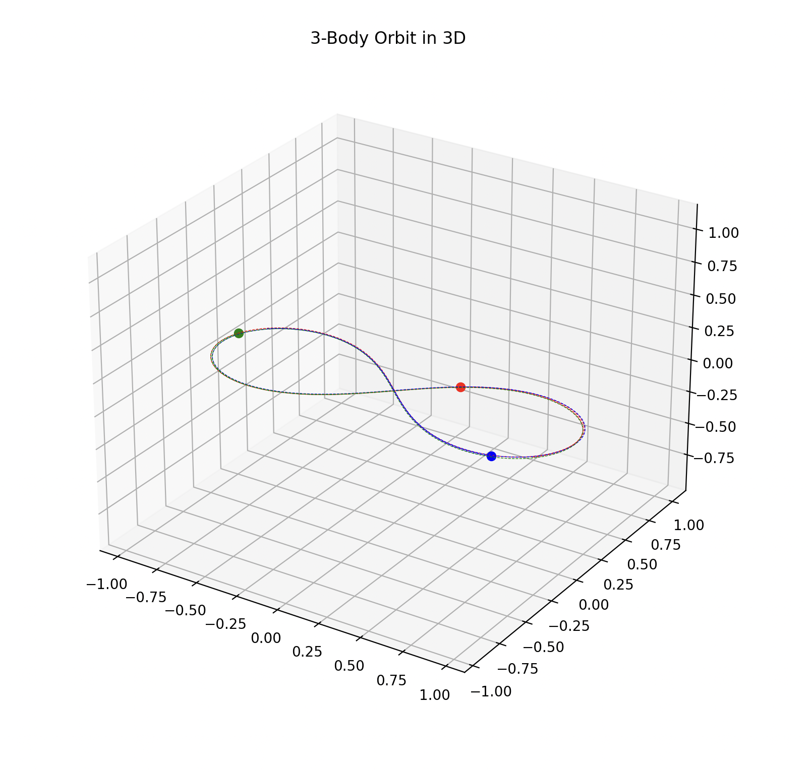

# CR3BP-dynamics

Selected simulations, plots, and small analysis tools from my work in **celestial mechanics** — primarily to better understand **N-body dynamics**, **perturbation methods**, **regularisation**, and numerical integration.  
This repository is intended as a *showcase and sandbox*, not a complete research code release.

---

## Context

Part of this work comes from my research-assistant tasks around the theoretical and computational investigation of periodicity in the 6-body stellar system **TIC 168789840**, including:
- perturbation-based reasoning (where applicable),
- regularisation techniques for improved numerical behavior near close approaches,
- numerical methods for orbit simulation and analysis.

To build intuition and validate implementation choices, the repo also includes simpler 2-body / 3-body experiments (including CR3BP-style setups and trajectory visualizations).

---

## What’s included (high level)

- **3-body / CR3BP-style simulations**
  - equations of motion
  - numerical integration (ODE solvers)
  - basic diagnostics and plotting utilities
- **Selected plots and visualizations**
  - trajectories in 3D
  - example configurations / initial conditions
- **(Optional / in progress)** tools for section crossings and simple Poincaré-type explorations

> Note: code and plots are intentionally curated; not all internal experiments are included.

---

## Gallery (selected outputs)

  

<em>Example 3-body trajectory (3D).</em>

The remarkable figure-8 solution found in 1993 by Christopher Moore.

<table>
  <tr>
    <td align="center" width="50%">
      
       <em>Configuration / reference setup.</em>
    </td>
    <td align="center" width="50%">
      
       <em>3-body simulation (3D trajectory view).</em>
    </td>
  </tr>
  <tr>
    <td align="center" width="50%">
      
       <em>3-body simulation (alternative initial condition / viewpoint).</em>
    </td>
    <td align="center" width="50%">
      <!-- Optional: add another figure later -->
        
      <em>More figures may be added as the repository is cleaned up.</em>
    </td>
  </tr>
</table>

---
